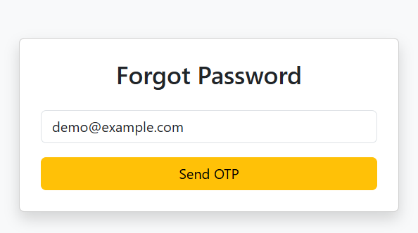
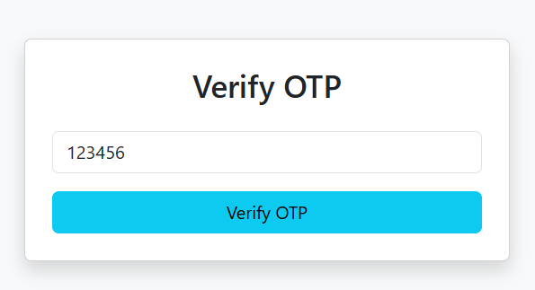

# ForgotPasswordResetByOTP

## Overview

This project is an OTP-based Forgot Password and Reset Password system built using ASP.NET MVC and SQL Server. It allows users to securely reset their password by verifying their identity through a One-Time Password (OTP) sent to their registered email.
The system ensures secure password recovery without exposing existing credentials, following standard authentication practices.

## Features

* Forgot Password functionality
* OTP generation and validation
* OTP expiry mechanism
* Secure password hashing
* Reset password after OTP verification
* SQL Server database integration

## How it works

* User clicks Forgot Password
* User enters registered email
* System generates OTP
* OTP is sent to email
* User enters OTP for verification
* If OTP is valid:
* User is allowed to reset password
* New password is updated in database

## Database Structure

## SQL 

1. Users Table

CREATE TABLE Users (
    UserId INT PRIMARY KEY IDENTITY(1,1),
    Email NVARCHAR(100) UNIQUE,
    Password NVARCHAR(MAX)
    OTP NVARCHAR(10),
    OTPExpiry DATETIME
   
   )

## Technologies Used

* ASP.NET MVC
* C#
* SQL Server
* HTML, CSS, Bootstrap

## Security Features

OTP-based verification
OTP expiry validation
Password hashing (no plain text storage)
One-time OTP usage

## Installation

### Clone Repository

```bash
git clone <https://github.com/RakeshPrajapati123>
```

### Setup Instructions

Open project in Visual Studio
Configure database connection in Web.config

### Run Application

* Run the Project

## 📸 Screenshots

### Forgot Password Reset Functionality By OTP







## Learning Objectives

This project was created to learn:

* Understanding user authentication and authorization flow
* Implementing Forgot Password functionality using OTP verification
* Generating and validating One-Time Password (OTP) securely
* Working with SQL Server database design and relationships
* Handling secure password hashing instead of storing plain text passwords
* Managing time-based OTP expiration logic
* Building end-to-end backend workflow for password recovery
* Improving understanding of real-world security practices in web applications

## Future Enhancements

* SMS OTP support
* Two-factor authentication (2FA)
* Form Validation
* Responsive Design

## Author

Rakesh Prajapati

.NET Developer (ASP.NET MVC, SQL Server)
